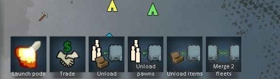

## RimWorld Self Launching Pods Mod (A18)

### Discontinued project

I am done with RimWorld. The project has not been updated for A18.
If you are interested in maintaining the mod, feel free to text me.

### About

An MK2 version of the vanilla pod with launcher that can be used from anywhere in the world.
Use for quick trade or quests.

### Features

* New pod that does not require a pod launcher.
* Lift off from anywhere.
* Trade, Raid.
* Trade remotely with factions where you have pods using comms console. (No colonist required on location).
* Load downed pawns into all kind of pods.
* Landing spot to designate landing locations.
* Load / unload your caravan from a pods fleet.

Powered by [HugsLib](https://github.com/UnlimitedHugs/RimworldHugsLib) and [Harmony Patch Library](https://github.com/pardeike/Harmony)

### License

Free. Just give credits.

### More

